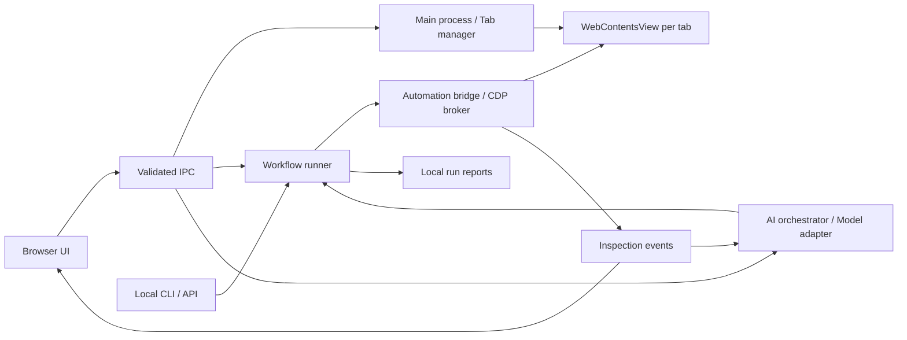

**Browser Nova — แผนพัฒนาเบราว์เซอร์สำหรับ HTTP, ตรวจสอบเว็บ และ Automation**

จัดทำวันที่ 21 กันยายน 2026 สถานะ: แผนก่อนเริ่มพัฒนา โฟลเดอร์โปรเจกต์ยังไม่มีซอร์สโค้ด เป้าหมายคือแอปเดสก์ท็อปที่เปิดเว็บไซต์จริง ตรวจสอบหน้าเว็บ และสั่งงานแท็บเดียวกับที่ผู้ใช้เห็นได้

ผู้ใช้ยืนยันให้พัฒนา **macOS ก่อน แล้วขยายไป Windows** และใช้ **คำสั่งภาษาธรรมชาติให้ AI ทำงานเป็นช่องทางหลักตั้งแต่ MVP** โดยมี workflow และ tool API เป็นกลไกภายใน ส่วนการบันทึกคลิกเป็นระยะถัดไป คำว่า “ตรวจสอบเว็บ” ในแผนหมายถึง DOM, CSS, Console, Network และการตรวจผลลัพธ์ของหน้าเว็บ หากต้องการสแกนช่องโหว่จะต้องกำหนดขอบเขตเพิ่มเติม

ได้ตรวจพบแอป Build Web Page ที่ผู้ใช้ระบุ แต่การอ่านหน้าต่างผ่าน Computer Use หมดเวลาสองครั้ง จึงยังไม่ได้ตรวจการทำงานภายในหรือแก้ไขแอปนั้น แผนนี้อิงจากข้อกำหนดของผู้ใช้และเอกสารเทคนิค

เลือกใช้ **Electron + Chromium + TypeScript** โดยใช้ React สำหรับแถบ URL, แท็บ, แผงตรวจสอบ และแผง automation แต่ละแท็บเว็บไซต์ใช้ `WebContentsView` ซึ่ง Electron เปิดให้ควบคุมผ่าน `webContents` ได้โดยตรง การทำเป็นแอปเดสก์ท็อปช่วยให้ควบคุมเว็บไซต์ได้ครบกว่าหน้าเว็บที่ฝังเว็บไซต์อื่นใน iframe ซึ่งขึ้นกับข้อจำกัดการฝังของเว็บไซต์ปลายทาง อ้างอิง: [WebContentsView](https://www.electronjs.org/docs/latest/api/web-contents-view), [Web Embeds](https://www.electronjs.org/docs/latest/tutorial/web-embeds)

พฤติกรรมการเปิด HTTP ต้องกำหนดให้ชัดตั้งแต่ต้น:

| กรณี | พฤติกรรมที่ต้องได้ |
| --- | --- |
| ระบุ `http://host:port/path` | ส่ง URL ตามที่ระบุไปยัง engine โดยแอปไม่เติมหรือบังคับ HTTPS เอง |
| HTTP บน localhost, IP ภายใน หรือเว็บที่ให้บริการ HTTP | เปิดหน้าได้ พร้อมสถานะ “HTTP — ไม่เข้ารหัส” ที่แถบ URL |
| ระบุ `https://` | ใช้ HTTPS และตรวจใบรับรองตามปกติ |
| กรอก host โดยไม่มี scheme | ค่าเริ่มต้นใช้ HTTPS; มีตัวเลือก “เปิดด้วย HTTP” ที่มองเห็นชัดและจำค่าราย host ได้ |
| server ส่ง redirect ไป HTTPS | แสดง URL ปลายทางและ redirect chain; ไม่วนบังคับกลับ HTTP |
| host ใช้ HSTS หรืออยู่ใน preload list | เคารพการอัปเกรดของ Chromium และแสดงข้อมูลที่ตรวจยืนยันได้; ไม่สัญญาว่าบังคับทุกเว็บเป็น HTTP ได้ |
| HTTP โหลดไม่สำเร็จ | แสดงสาเหตุ DNS, timeout, connection refused หรือข้อมูลที่ engine รายงาน |
| HTTPS โหลด HTTP resource | แสดงปัญหา mixed content ในเครื่องมือตรวจสอบตามพฤติกรรม engine |

HSTS สามารถเปลี่ยนคำขอ HTTP เป็น HTTPS ก่อนติดต่อ server ส่วนการเปิดหน้า HTTP ระดับบนสุดเป็นคนละกรณีกับ HTTPS ที่โหลด HTTP resource ภายในหน้า ดังนั้นไม่ต้องปิด web security ทั้งระบบเพื่อให้เปิด HTTP ได้ อ้างอิง: [HSTS](https://developer.mozilla.org/en-US/docs/Web/HTTP/Reference/Headers/Strict-Transport-Security), [Mixed content](https://developer.mozilla.org/en-US/docs/Web/Security/Defenses/Mixed_content)

บาง Web API ต้องใช้ secure context จึงไม่ควรรับรองว่าทุกฟีเจอร์ของเว็บไซต์จะทำงานบน HTTP เหมือน HTTPS และต้องทดสอบเว็บใน LAN แยกจาก localhost ซึ่งได้รับการปฏิบัติเป็นกรณีพิเศษ อ้างอิง: [Secure contexts](https://developer.mozilla.org/en-US/docs/Web/Security/Defenses/Secure_Contexts)

ขอบเขตเวอร์ชันแรกประกอบด้วย:

| ส่วน | ความสามารถ |
| --- | --- |
| Browser | เปิด/ปิด/สลับแท็บ, URL, Back/Forward, Reload/Stop, loading/error state, ยืนยันแท็บเป้าหมายก่อนรัน |
| Session | โปรไฟล์ปกติแบบคงอยู่และโปรไฟล์ทดสอบแยกกัน; เปิดใหม่แล้วใช้ session เดิมตามโปรไฟล์ที่เลือก |
| Inspect | DevTools สำหรับ Elements/CSS/Console/Network/Storage; แผงย่อสำหรับเลือก element, copy selector, ดู console error และ request ที่ล้มเหลว |
| Automation | เปิด URL, click, fill, select, press key, scroll, wait, assert, extract และ screenshot |
| AI Assistant | พิมพ์คำสั่งไทย/อังกฤษ, อ่านสถานะหน้าเว็บ, แสดงขั้นตอนที่จะทำ, ทำงานผ่าน tool API และตรวจผลหลังแต่ละ action |
| Run control | Run/Pause/Resume/Stop, รันทีละขั้น, timeout รายขั้น, แสดงขั้นตอนปัจจุบันและสาเหตุผิดพลาด |
| Evidence | เก็บ URL ก่อน/หลัง, เวลา, ผลรายขั้น, console/network ที่เกี่ยวข้อง และ screenshot เมื่อผิดพลาด |
| Integration | บันทึก workflow เป็น JSON และเรียกผ่าน CLI/local API เพื่อให้เครื่องมือภายนอกสั่งงานได้ |

หน้าต่างหลักมีแถบแท็บและ URL ด้านบน หน้าเว็บตรงกลาง และแผงด้านขวาสลับระหว่าง “ผู้ช่วย AI” กับ “ตรวจสอบเว็บ” ผู้ใช้สั่งงานในช่องแชต เช่น “เปิดเว็บ HTTP นี้ ค้นหาคำว่า nova แล้วสรุปผลพร้อมถ่ายภาพ” หรือ “ตรวจหน้าเว็บนี้ว่ามี request ไหนล้มเหลว” จากนั้นเห็นขั้นตอน ผลลัพธ์ และปุ่มหยุดในแผงเดียวกัน โดยไม่ต้องเขียน JSON

ยังไม่รวมระบบ sync บัญชี, ร้าน extensions, password manager, mobile, การสั่งงานระยะไกลผ่านอินเทอร์เน็ต, การรับประกัน DRM/ทุกระบบ SSO และการทำ browser engine เอง

โครงสร้างแบ่งหน้าที่ดังนี้:



Main process เป็นผู้ถือสิทธิ์สร้างแท็บ จัดการ session และเรียก Electron API ส่วนหน้าเว็บภายนอกแยกจาก UI ของแอปและไม่ได้รับ privileged preload กำหนด `nodeIntegration: false`, `contextIsolation: true`, `sandbox: true`, `webSecurity: true` พร้อมตรวจผู้ส่งและรูปแบบข้อมูลของ IPC เพื่อให้การเปิดเว็บ HTTP ไม่เปิดทางให้หน้าเว็บเข้าถึงไฟล์หรือคำสั่งของเครื่อง อ้างอิง: [Electron Security](https://www.electronjs.org/docs/latest/tutorial/security)

Automation bridge ใช้ `webContents.debugger` เป็น transport ของ Chrome DevTools Protocol (CDP) และให้ broker เดียวดูแลแต่ละแท็บ ทั้ง inspection และ automation ต้องส่งผ่าน broker นี้ ปรับ mapping ระหว่าง `tabId`, `webContents`, frame และ document ใหม่ทุกครั้งที่นำทาง ไม่เก็บ element reference ข้ามการโหลดหน้าโดยไม่ตรวจใหม่ อ้างอิง: [Electron Debugger](https://www.electronjs.org/docs/latest/api/debugger)

การเปิด DevTools สามารถทำให้ debugger ที่แนบกับแท็บถูก detach ได้ จึงกำหนด MVP ให้แผง inspection ย่อทำงานร่วมกับ runner ได้ ส่วนการเปิด DevTools เต็มระหว่างรันให้หยุดที่ขอบเขตขั้นตอนที่ปลอดภัย ถ้าถูก detach กลางขั้นตอนต้องรายงานว่าผลขั้นตอนยังไม่แน่นอน และห้ามเล่น action นั้นซ้ำอัตโนมัติ เมื่อปิด DevTools ให้เชื่อมใหม่และตรวจ URL/สถานะก่อน Resume อ้างอิง: [Debugger detach event](https://www.electronjs.org/docs/latest/api/debugger#event-detach)

ใช้ Playwright สำหรับทดสอบตัวแอปและ fixture ที่ควบคุมได้ โดยทำ compatibility spike ก่อน เพราะการรองรับ Electron ยังเป็น experimental ส่วน `connectOverCDP` มีข้อจำกัดมากกว่าการเชื่อมผ่าน Playwright protocol จึงยังไม่กำหนดให้ external Playwright attach เป็นสัญญาหลักของ MVP อ้างอิง: [Playwright Electron](https://playwright.dev/docs/api/class-electron), [connectOverCDP](https://playwright.dev/docs/api/class-browsertype#browser-type-connect-over-cdp)

สัญญา automation ที่ต้องออกแบบก่อนลง UI มีดังนี้:

- ทุกคำสั่งมี `runId`, `stepId`, `tabId`, timeout และผลลัพธ์แบบ structured; workflow มี `schemaVersion` และรายการ origin ที่อนุญาต
- เริ่มจาก locator แบบ CSS หรือ `data-testid` ที่ไม่กำกวม พร้อมระบุ frame; การใช้ role/text และ iframe ข้าม origin ต้องผ่าน prototype ก่อนรับเป็นความสามารถที่รองรับ
- `click` และ `fill` ต้องรอ element ที่มองเห็นและใช้งานได้ ไม่ใช้การหน่วงเวลาคงที่แทนการตรวจสถานะ
- จับ element ใหม่หลัง navigation หรือ DOM เปลี่ยน, จัดการ popup/dialog และรายงาน selector ที่ไม่พบหรือพบหลายจุด
- ต่อแท็บมี run ที่ควบคุม action ได้หนึ่งชุด; เมื่อผู้ใช้เปลี่ยนหน้าเองให้ Pause และตรวจสถานะก่อนทำต่อ
- Retry เฉพาะการอ่านหรือรอที่ทำซ้ำได้ การส่งฟอร์มและ action ที่อาจเกิดผลไปแล้วต้องรายงานความไม่แน่นอนแทนการกดซ้ำ
- Stop ยกเลิกการรอและคำสั่งถัดไปได้ทันที แต่ไม่ย้อนผลของ action ที่ส่งไปแล้ว
- API ภายนอกใช้ local socket ที่จำกัดสิทธิ์ผู้ใช้และ token ต่อ session; ไม่เปิด raw CDP port ให้หน้าเว็บหรือเครือข่ายเข้าถึงโดยปริยาย
- Scripts ภายนอกเรียกชุดคำสั่งที่กำหนดไว้ผ่าน CLI/API; workflow JSON ไม่รัน arbitrary Node.js หรือ shell ใน main process
- เก็บ report ลงเครื่อง และปกปิด authorization headers, cookie values และค่าที่ระบุเป็น secret ใน log; screenshot อาจมีข้อมูลบนหน้าจอจึงต้องกำหนดการเก็บและลบได้

AI orchestrator ใช้วงจร “อ่านสถานะ → เลือก action → ทำงาน → อ่านสถานะใหม่ → ตรวจผล” และมีข้อกำหนดดังนี้:

- เริ่มจาก prompt ผู้ใช้, แท็บเป้าหมาย และ origin ที่อนุญาต; ส่ง DOM/accessibility snapshot ที่จำกัดขนาดให้ model และใช้ screenshot เมื่อต้องอ่านภาพหรือ layout
- ให้ model เรียก typed tools เช่น `observe`, `navigate`, `click`, `fill`, `inspectNetwork`, `assertText`, `screenshot` ผ่าน runner เท่านั้น; validate arguments และสิทธิ์ก่อนเรียกจริง
- เริ่มใช้ DOM locator เป็นหลัก; coordinate action ต้องผูกกับภาพล่าสุดและทดสอบแยก ไม่ถือว่าการคลิกตำแหน่งเดิมหลังหน้าเปลี่ยนถูกต้องเสมอ
- แสดงแผนย่อก่อนเริ่มและผลแต่ละขั้นระหว่างทำงาน; งานอ่านข้อมูลและการนำทางตามคำสั่งเริ่มได้เลย ส่วนการส่งข้อความ ซื้อสินค้า หรือลบข้อมูลต้องแสดงเป้าหมายและผลที่จะเกิดขึ้นให้ยืนยันก่อน action นั้น
- เนื้อหาบนเว็บไซต์เป็นข้อมูลประกอบ ไม่สามารถแก้คำสั่งผู้ใช้ เพิ่ม origin ที่อนุญาต หรือสั่งให้เปิดไฟล์/ส่งข้อมูลออกเองได้
- จำกัดค่าเริ่มต้นไว้ที่ 20 actions และ 3 นาทีต่อ run พร้อมเพดาน token/ค่าใช้จ่ายที่ตั้งได้; เมื่อเกินงบ วนซ้ำ หรือไม่แน่ใจให้หยุดพร้อมเหตุผล
- ระบุสถานะ `planning`, `running`, `waiting_for_user`, `paused`, `succeeded`, `failed`, `cancelled`; การเปลี่ยนแท็บหรือหน้าโดยผู้ใช้ต้องทำให้ AI ตรวจสถานะใหม่
- ผลสรุปอ้างถึงหลักฐานจากหน้าเว็บและ artifact ที่ได้จริง; คำตอบจาก model อย่างเดียวไม่ใช้เป็นหลักฐานว่า action สำเร็จ
- Model adapter ต้องรองรับ tool calling และ structured output; ทำ prototype กับผู้ให้บริการหนึ่งรายก่อน โดยยังไม่ล็อกชื่อ model หรือราคาในแผนนี้
- เก็บ API key ใน macOS Keychain และเรียก model จาก process ที่แยกจากหน้าเว็บ; UI ระบุผู้ให้บริการและขอบเขตข้อมูลที่จะส่ง ลดข้อมูลที่ส่งและไม่แนบรหัสผ่าน/cookie โดยปริยาย
- หากใช้ cloud model ต้องมีอินเทอร์เน็ตสำหรับ AI แม้เว็บเป้าหมายอยู่ใน LAN; การเปิดเว็บและ DevTools ยังใช้งานได้เมื่อ AI ไม่พร้อม ส่วน local model เป็นทางเลือกขยายภายหลัง

ตัวอย่าง workflow ภายในที่ AI สามารถสร้างผ่านชุด tools เดียวกัน โดย URL และ selector อ้างถึง fixture สำหรับทดสอบที่ต้องสร้างในโปรเจกต์:

```json
{
  "schemaVersion": 1,
  "name": "ค้นหาบนเว็บ HTTP",
  "allowedOrigins": ["http://127.0.0.1:8080"],
  "steps": [
    { "id": "open", "action": "navigate", "url": "http://127.0.0.1:8080", "timeoutMs": 10000 },
    { "id": "query", "action": "fill", "selector": "[data-testid=search]", "value": "nova", "timeoutMs": 5000 },
    { "id": "submit", "action": "click", "selector": "[data-testid=submit]", "timeoutMs": 5000 },
    { "id": "check", "action": "assertText", "selector": "[data-testid=result]", "contains": "nova", "timeoutMs": 5000 },
    { "id": "capture", "action": "screenshot", "artifact": "result.png", "timeoutMs": 5000 }
  ]
}
```

ตัว runner ต้อง resolve artifact ภายในโฟลเดอร์ของ run และตรวจ origin รวมถึง redirect และ popup ก่อนทำ action ถัดไป เพื่อให้คำสั่งทำงานกับเป้าหมายที่ระบุไว้

ลำดับพัฒนาและจุดตรวจรับใช้ประมาณ **20–30 วันทำงานของนักพัฒนาหนึ่งคน หรือ 4–6 สัปดาห์** สำหรับ MVP บน macOS รวม AI แบบภาษาธรรมชาติ นี่เป็นประมาณการเพื่อวางแผน ต้องปรับหลัง prototype และยังไม่รวม Windows, recorder หรือเวลาจัดเตรียมบัญชีสำหรับ signing/notarization

| ระยะ | งาน | ผลที่ต้องตรวจรับก่อนเดินต่อ | ประมาณ |
| --- | --- | --- | --- |
| 0 — พิสูจน์ข้อจำกัด | สร้าง Electron spike; เปิด HTTP/HTTPS; ทดลอง CDP, Playwright และ model tool call | HTTP localhost และ LAN ใช้งานได้; AI เรียกหนึ่ง action แล้วตรวจผลบนแท็บที่เห็น; รู้พฤติกรรม DevTools detach, iframe และ popup | 2–3 วัน |
| 1 — Browser หลัก | ตั้งโปรเจกต์ TypeScript/React, tab manager, navigation, profiles, IPC และ error UI | เปิดหลายแท็บ, ย้อน/เดินหน้า, ปิดแล้วเปิด session เดิม และแยกโปรไฟล์ได้ | 3–4 วัน |
| 2 — ตรวจสอบเว็บ | DevTools, element picker, console/network summary และ lifecycle ของ debugger | ตรวจ element และ request/error ได้; DevTools ไม่ทำให้ run ดำเนินต่อแบบเงียบ ๆ หลัง debugger หลุด | 3–4 วัน |
| 3 — Automation | workflow schema, action executor, Run/Pause/Stop, CLI/API และ report | รัน workflow HTTP ที่กำหนดได้ พร้อม assert และ screenshot; ล้มเหลวแล้วอธิบายขั้นตอนและสาเหตุได้ | 5–7 วัน |
| 4 — AI ภาษาไทย | แผงแชต, model adapter, page observation, tool loop, ตรวจผล และจำกัดงบ | รับคำสั่งภาษาธรรมชาติบน fixture แล้วทำงานผ่าน runner พร้อมหลักฐาน; หยุด/ถามเมื่อข้อมูลไม่พอโดยไม่เดาผลสำเร็จ | 5–8 วัน |
| 5 — พร้อมใช้ภายใน | ทดสอบ end-to-end, crash/cleanup, package แอป, คู่มือ และ smoke test รุ่น packaged | เปิดแอปจาก package บนเครื่องสะอาดได้ และผ่านเกณฑ์ด้านล่าง; ระบุสถานะ signing อย่างตรงไปตรงมา | 2–4 วัน |

ชุดทดสอบต้องมี server fixture ที่ควบคุมได้ ไม่พึ่งเว็บไซต์สาธารณะซึ่งอาจเปลี่ยนหรือ redirect เอง:

| กลุ่ม | เกณฑ์ผ่าน |
| --- | --- |
| HTTP จริง | เปิด localhost, loopback และ host/IP ใน LAN ที่ไม่มี HSTS; URL คง HTTP และไม่มีคำขอ HTTPS ที่แอปสร้างเพิ่มเอง |
| HTTPS และ redirect | HTTPS ที่ใบรับรองถูกต้องเปิดได้; HTTP redirect แสดงปลายทางถูกต้อง; HSTS ที่ตั้งไว้ในโปรไฟล์ทดสอบไม่ทำให้แอปวน redirect |
| Mixed content / secure context | อธิบาย error ได้ตาม fixture; ไม่มีการปิด web security เพื่อซ่อนข้อผิดพลาด |
| Browser/session | แท็บแต่ละอันคง URL/history ของตัวเอง, cookie แยกตามโปรไฟล์, ปิดแท็บแล้วทำลาย webContents และ listener |
| Inspect | พบ element, console error และ request ที่จงใจให้ล้มเหลว; การเปิด/ปิด DevTools ถูกสะท้อนในสถานะ run |
| Automation สำเร็จ | workflow สาธิตผ่าน 10 รอบต่อเนื่องบน fixture เดิม พร้อมผล assertion และ artifact ครบ |
| Automation ล้มเหลว | element หาย/ซ้ำ, timeout, redirect นอกขอบเขต, แท็บปิด, debugger หลุด และ Stop ให้ผลชัดเจนโดยไม่ส่ง action ซ้ำ |
| AI ภาษาไทย | ชุดงานอ่านข้อมูล/ค้นหา/กรอกฟอร์มทดสอบ/ตรวจ request อย่างน้อย 10 คำสั่ง รันคำสั่งละ 3 ครั้ง และรายงานอัตราสำเร็จ; เป้ารับ MVP อย่างน้อย 27/30 พร้อมตรวจผลที่ fixture แยกจากคำตอบ AI |
| AI ควบคุมได้ | หยุดเมื่อเกินงบหรือวนซ้ำ; ไม่ทำ action นอก origin, ไม่เชื่อคำสั่งแทรกในหน้าเว็บ, ไม่อ้างว่าสำเร็จเมื่อ assertion ล้มเหลว และรอการยืนยันก่อน action ที่กำหนดไว้ทุกครั้ง |
| Isolation | เว็บภายนอกเรียก Node/privileged IPC/local automation API ไม่ได้; log ไม่เผยค่าที่ fixture กำหนดเป็น secret |
| Distribution | packaged app รันได้โดยไม่พึ่ง dev server และรายงาน Electron/Chromium/app version เพื่อช่วยวิเคราะห์ปัญหา |

โครงสร้างไฟล์ที่เสนอสำหรับเริ่มพัฒนา:

```text
src/main/                 # window, tabs, sessions, navigation, permissions
src/preload/              # bridge สำหรับ UI ที่เชื่อถือได้เท่านั้น
src/renderer/             # browser UI, inspector summary, workflow editor
src/automation/           # schema, runner, CDP broker, locators, artifacts
src/ai/                   # model adapter, observations, tool loop, budgets
src/shared/               # types, command validation, error codes
packages/cli/             # local client และ JSON workflow commands
tests/fixtures/           # HTTP/HTTPS, forms, dialogs, frames, redirects
tests/e2e/                # integration และ packaged smoke tests
docs/                     # user guide, API contract, compatibility notes
```

หลัง MVP จึงเพิ่ม Windows พร้อมทดสอบ packaging, shortcuts, credential storage และ local IPC บนระบบนั้น จากนั้นเพิ่ม recorder สำหรับบันทึก click/fill เป็น workflow ที่แก้ไขและเล่นซ้ำได้ รวมถึงประเมิน local model หากต้องการให้ AI ทำงานออฟไลน์หรือไม่ส่งข้อมูลเว็บออกจากเครื่อง

ข้อเสนอเพิ่มเติมจากคำถามเรื่อง “Cloning, Copy, สำเนา, ดูด” และภาพอ้างอิง: เพิ่มพื้นที่ **Design Lab** สำหรับคัดลอกส่วนประกอบ เก็บสำเนาหน้าเว็บ ดึงข้อมูล และให้ AI สร้างหน้าขึ้นใหม่ ภาพแสดงแนวทางใช้ DOM/CSS, screenshot, element picker และ export เอกสารร่วมกัน แต่ยังไม่ใช่หลักฐานว่าฟีเจอร์ทั้งหมดในภาพทำงานอย่างไร ข้อเสนอต่อไปนี้เป็นงานขยายที่ยังไม่ได้รวมเข้าเวลาประเมิน MVP 4–6 สัปดาห์

| กลุ่ม | ฟีเจอร์ที่เสนอ | สิ่งที่ผู้ใช้ได้รับ | ลำดับที่แนะนำ |
| --- | --- | --- | --- |
| Copy | Smart Copy / Element Picker | เลือกปุ่ม การ์ด ตาราง หรือ section แล้วคัดลอกข้อความ, DOM HTML, CSS ที่คำนวณแล้ว, selector หรือภาพเฉพาะส่วน | ชุดแรก |
| Copy | Design Tokens | สรุปสี ฟอนต์ spacing radius และ shadow ที่ตรวจพบ พร้อมตำแหน่งอ้างอิง; export เป็น JSON/CSS variables | ชุดแรก |
| สำเนา | Page Snapshot | ภาพเต็มหน้า, PDF, HTML พร้อมไฟล์ประกอบ หรือ MHTML พร้อม URL เวลา viewport และสถานะหน้า | ชุดแรก |
| ดูดข้อมูล | Asset Collector | เลือกรูป SVG ไอคอน และไฟล์ที่หน้าเว็บเปิดเผย/โหลดได้ แล้ว export เป็นโฟลเดอร์หรือ ZIP พร้อม source manifest | ชุดแรก |
| ดูดข้อมูล | Table / List Extractor | เลือกตารางหรือรายการ ให้ AI จับคู่คอลัมน์ ตรวจตัวอย่าง แล้ว export CSV/JSON พร้อม URL แหล่งที่มา | ชุดแรก |
| ส่งต่อ AI | Design Evidence Pack | รวม screenshot, โครงสร้าง DOM, styles, tokens, assets และข้อสังเกตเป็นชุด Markdown/JSON สำหรับสร้างหน้าต่อ | ชุดแรก |
| Cloning | AI Rebuild | สร้างโค้ดหน้าใหม่เป็น HTML/CSS หรือ React/TypeScript จากหลักฐานที่เก็บ พร้อม local preview และรายการส่วนที่ยังจำลอง | ชุดถัดไป |
| ตรวจสำเนา | Visual Compare | ดูต้นฉบับเทียบกับหน้าที่สร้างใหม่แบบข้างกัน/ภาพซ้อน และชี้ตำแหน่งที่สี ขนาด spacing หรือฟอนต์ต่างกัน | ทำคู่กับ AI Rebuild |
| หลายหน้า | Multi-page Capture | เก็บเฉพาะ URL ที่เลือกหรือค้นลิงก์ภายในขอบเขตที่กำหนด พร้อมเพดานหน้า/ความลึก/เวลา และหยุดต่อได้ | ชุดถัดไป |
| พฤติกรรม | Interaction Capture | เก็บสถานะหลังเปิดเมนู เปลี่ยนแท็บ กดค้นหา หรือเปิด modal เพื่อให้ AI เห็นมากกว่าภาพนิ่งหนึ่งหน้า | ชุดถัดไป |

UI ของ Design Lab ใช้ปุ่มหลัก **Copy / Save Snapshot / Extract / Rebuild** และให้เลือกขอบเขต **Element / Section / Page / Selected Pages** ก่อนเริ่ม แสดงรายการไฟล์หรือข้อมูลที่กำลังจะ export พร้อมตัวอย่างผล ผู้ใช้ยังเรียกผ่านแชต AI ได้ เช่น “คัดลอกการ์ดนี้เป็น React”, “ดึงตารางนี้เป็น CSV” หรือ “เก็บ 3 หน้านี้เป็นชุดข้อมูลสำหรับสร้างเว็บใหม่”

ความสามารถแต่ละกลุ่มมีผลลัพธ์ต่างกัน: Copy เก็บส่วนที่เลือก, Snapshot เก็บสภาพหน้า ณ เวลาหนึ่ง, Extract ดึงข้อมูลเป็นโครงสร้าง และ Rebuild สร้างโค้ดใหม่จากสิ่งที่สังเกตได้ การทำสำเนา DOM/CSS ไม่ได้กู้ source component เดิม เช่น JSX/TypeScript และไม่สามารถดึง PHP, service logic หรือฐานข้อมูลที่ไม่ได้ส่งมายัง browser ได้

สำหรับ Snapshot ใช้ Electron `savePage` ซึ่งมี HTMLOnly, HTMLComplete และ MHTML เป็นฐานได้ แต่ต้องทดสอบการเปิดกลับจริง โดยเฉพาะเว็บที่พึ่ง API, login, lazy loading หรือ canvas จึงไม่รับรองว่า snapshot จะทำงานครบแบบเว็บออนไลน์ อ้างอิง: [Electron savePage](https://www.electronjs.org/docs/latest/api/web-contents#contentssavepagefullpath-savetype)

สำหรับ Smart Copy และ Evidence Pack ใช้ DOM snapshot และ CSS inspection ผ่าน CDP แล้วแปลงเป็นรูปแบบของ Nova ต้องแยกค่า computed style ที่เห็น ณ viewport ปัจจุบันออกจากกฎ responsive ที่ตรวจพบจริง พร้อมเก็บภาพหลายขนาดและสถานะที่เกี่ยวข้องก่อนสรุปพฤติกรรม อ้างอิง: [CDP DOMSnapshot](https://chromedevtools.github.io/devtools-protocol/tot/DOMSnapshot/), [CDP CSS](https://chromedevtools.github.io/devtools-protocol/tot/CSS/)

Evidence Pack ที่เสนอประกอบด้วย `manifest.json`, `design.md`, `components.md`, `tokens.json`, `screenshots/`, `assets/`, `observed-flows.md` และ `open-questions.md` โดยทุกข้อสรุปแยกสถานะ **ตรวจพบจริง / AI อนุมาน / ยังไม่ทราบ** และผูกกับ URL, viewport, เวลา และ artifact ที่เกี่ยวข้อง หากมีไฟล์ข้อเสนอฐานข้อมูลให้ใช้ชื่อ `proposed-data-model.md` และระบุว่าเป็นโครงสร้างที่เสนอใหม่ ไม่ใช่ schema ต้นฉบับจากระบบปลายทาง

Asset manifest ระบุ source URL, MIME type, hash, ชื่อไฟล์ที่ export และสถานะครบ/ขาด/โหลดไม่ได้ ชื่อไฟล์ต้องถูก normalize และเขียนได้เฉพาะโฟลเดอร์ export; ไม่ตีความชื่อ asset เป็น path หรือคำสั่ง ตรวจ iframe, shadow DOM, canvas, video และทรัพยากรที่โหลดไม่ได้เป็นรายกรณี แล้วใส่รายงานข้อจำกัดแทนการอ้างว่าเก็บครบ

Data Extractor ต้องเก็บตัวอย่างให้ตรวจคอลัมน์ก่อน export แยก “แถวที่โหลดแล้ว” ออกจาก “ข้อมูลทั้งหมด” และตั้งเพดานการเลื่อนหรือเปลี่ยนหน้าเพื่อดึงข้อมูลเพิ่ม ฟีเจอร์ network export สามารถต่อยอดเป็น HAR และตัวอย่าง API response ที่ลบข้อมูลลับได้ โดยการตัด Cookie/Authorization header อย่างเดียวไม่ทำให้ body หรือ query string ปราศจากข้อมูลลับ อ้างอิง: [Chrome DevTools network export](https://developer.chrome.com/docs/devtools/network/reference/#save-as-har)

AI Rebuild ต้องใช้ไฟล์ที่สร้างใหม่และรัน preview แยกจาก session ต้นฉบับ ไม่คัดลอก cookies หรือเชื่อมระบบเขียนข้อมูลเดิมโดยอัตโนมัติ ในเวอร์ชันแรกใช้ mock data และแสดง action ที่ยังเป็นตัวจำลอง การรับรองความใกล้เคียงอาศัยภาพที่ viewport/state เดียวกัน ร่วมกับการทดสอบ interaction ที่กำหนดไว้ ไม่ใช้คะแนนภาพเพียงอย่างเดียวตัดสินว่าการใช้งานเหมือนต้นฉบับ

เกณฑ์รับงานขยายที่ควรกำหนดก่อนเริ่ม implementation:

- Smart Copy แสดง element/ขอบเขตที่เลือกชัดเจน และ snippet ที่วางในหน้า preview มี style สำคัญครบใน fixture ที่รองรับ
- Snapshot เปิดตรวจย้อนหลังได้และมีรายการ resource ที่ขาด; แบบ preview สำหรับอ่านต้องไม่ส่งฟอร์มหรือเรียก action ที่เขียนข้อมูลกลับต้นทาง
- Asset export ไม่มีชื่อชนหรือเขียนไฟล์ออกนอกโฟลเดอร์ปลายทาง และระบุแหล่งที่มาทุกรายการ
- Data export จำนวนแถวและค่าตรงกับ fixture รวมภาษาไทย multiline และอักขระพิเศษ; CSV ป้องกันค่าที่อาจถูกโปรแกรมตารางตีความเป็นสูตร
- Evidence Pack อ้างกลับไปยังหลักฐานได้ และข้อมูลที่ยังไม่ทราบไม่ถูกเปลี่ยนเป็นข้อเท็จจริงโดย AI
- Rebuild เปิด preview ได้, ผ่าน fixture interaction ที่ระบุ และมีผลเทียบภาพบนอย่างน้อย desktop/mobile พร้อมรายงานส่วนต่างที่ยังเหลือ
- Multi-page Capture ไม่ออกนอก URL/origin ที่กำหนด ไม่กดลิงก์ที่เปลี่ยนข้อมูลเพื่อค้นหน้า และรักษาข้อจำกัดจำนวนหน้า/เวลาเมื่อเกิด redirect หรือ URL ซ้ำ

งานแรกเมื่อเริ่ม implementation คือระยะ 0: พิสูจน์ว่าเปิดเว็บ HTTP จริง ให้ AI เรียก action และตรวจผลบนหน้าเดียวกันได้ โดยต้องบันทึกผลทดสอบและข้อจำกัดก่อนลงทุนสร้าง UI เต็มรูปแบบ เอกสารนี้ยังไม่ได้อ้างว่าพัฒนาหรือทดสอบตัวเบราว์เซอร์สำเร็จแล้ว
