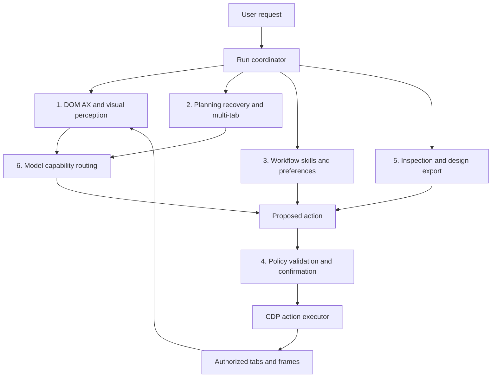

# Browser Nova — Super Agent Roadmap

**ต้นฉบับ:** Antigravity, 21 กันยายน 2026
**ปรับปรุงหลังตรวจโค้ด:** 22 กันยายน 2026 โดย Codex ตามการอนุมัติของผู้ใช้
**สถานะ:** แผนพัฒนา ยังไม่ใช่รายการฟีเจอร์ที่ส่งมอบแล้ว

เป้าหมายคือทำให้ Browser Nova เปิด HTTP/HTTPS ตรวจเว็บ และทำงานตามคำสั่งภาษาธรรมชาติได้โดยตรวจผลและหยุดได้จริง เริ่มบน macOS แล้วขยาย Windows ใช้ [PLAN.md](PLAN.md) เป็นบริบทผลิตภัณฑ์, [REVIEW.md](REVIEW.md) เป็นรายการข้อบกพร่อง และ [RELEASE.md](RELEASE.md) เป็นเงื่อนไขการเผยแพร่

## ส่วนที่เพิ่มนอก Phase หลัก (22 กันยายน 2026)

0.2.0 เพิ่ม Side Panel Extension Manager แบบจำกัดขอบเขตและทดสอบกับ loopback fixtures แล้ว ดู [EXTENSIONS.md](EXTENSIONS.md) ไม่ใช่การรองรับ Chrome Web Store ทุกตัว และไม่ถือว่า Phase 1 runtime/AI policy gates ด้านล่างผ่านโดยอัตโนมัติ

## 1. Baseline ที่ตรวจพบ

- มี Electron 34, WebContentsView, CDP Broker, Workflow Runner และ Mock/Gemini/OpenAI adapters; ส่งมอบ macOS Preview 0.1.1 แล้ว
- ผลทดสอบที่บันทึกจากรอบ 0.1.1 คือ unit 35 + smoke 19 + updater/config 10 = 64 รายการ Smoke ใช้ MockAdapter/observation จำลอง และ updater ใช้ fake driver จึงไม่ยืนยัน live AI หรือ signed update ครบวงจร
- `PageObserver` ใน [observation.ts](src/ai/observation.ts) ยังมี `(el as any).value` ในสตริง JavaScript ที่ส่งเข้าเว็บ และกลบความผิดพลาดเป็น observation ว่าง
- [orchestrator.ts](src/ai/orchestrator.ts) ยังไม่มีการ abort คำขอโมเดลจริงหรือ run lock; Network/Console tools ยังคืนข้อความคงที่
- Origin allowlist ตรวจเฉพาะ `navigate` ใน [runner.ts](src/automation/runner.ts) ส่วน AI เรียก ActionExecutor โดยตรง จึงต้องสร้างนโยบายร่วม ไม่ใช่เพียงเพิ่มการตรวจ redirect ใน runner
- เนื้อหาเว็บถูกแทรกลง system prompt ใน adapters; settings ยังเก็บ API keys เป็น plaintext และยังต้องแก้ IPC validation, CSP, confirmation routing, navigation failure, locator และ cleanup ตาม REVIEW
- Preview ยังไม่ notarize และปิด auto-update installation; การปรับ roadmap ไม่ได้เปลี่ยนสถานะนี้

## 2. สถาปัตยกรรมเป้าหมาย: 6 เสาหลัก

ทุกเส้นทางที่สั่งงานจริง รวม AI, workflow และ skill ต้องผ่านนโยบายเดียวกัน การจำแนกความเสี่ยงหรือข้อความจากโมเดลไม่ใช่สิทธิ์อนุญาตให้กระทำ

### 1) การรับรู้หน้าเว็บ

- เริ่มจาก DOM ที่อ่านได้จริงและ semantic AX tree ผ่าน `Accessibility.getFullAXTree`; กรองและจำกัดขนาดด้วย benchmark ไม่ตั้งสมมติฐานว่าจะลด token ได้เป็นเปอร์เซ็นต์ตายตัว
- เพิ่มภาพที่ผ่านการปิดบังข้อมูลลับในสัญญา `ModelAdapter` พร้อมชนิดภาพ ขนาด viewport และ capability ว่า provider รองรับภาพหรือไม่
- Set-of-Marks ต้องผูก `markId` กับ `tabId`, `frameId`, `observationId` และ navigation generation; ตรวจเป้าหมายซ้ำก่อน action และยกเลิกหมายเลขเก่าเมื่อหน้าเปลี่ยน
- Coordinate fallback ต้องมีภาพอ้างอิงล่าสุด แปลงพิกัด screenshot/viewport/zoom ให้ตรง และตรวจ hit target เท่าที่ทำได้ ถ้าเป้าหมายกำกวมให้สังเกตใหม่หรือขอข้อมูลเพิ่ม
- แยก fixture สำหรับ iframe, Shadow DOM, canvas, scroll และ zoom; ไม่ถือว่าพิกัดแก้การเข้าถึง DOM ทุกกรณี

### 2) การวางแผน การฟื้นตัว และหลายแท็บ

- แผนย่อยแต่ละข้อมี precondition, action และหลักฐานตรวจผล; ห้ามรายงานสำเร็จจากคำตอบโมเดลอย่างเดียว
- รอ element ที่มองเห็น เปิดใช้งาน และรับ input ได้ พร้อม deadline; หากใช้ความนิ่งของ DOM ให้เป็นสัญญาณประกอบ
- ไม่มี CDP event ชื่อ `Network.idle`: หากต้องใช้ให้สร้างตัวนับคำขอจาก request/finish/fail events เอง พร้อมนโยบายสำหรับ long polling/WebSocket และเวลารอสูงสุด ไม่ใช้ network idle เป็นเงื่อนไขเดียว
- Recovery มี retry budget และตรวจผลก่อนทำซ้ำ โดยเฉพาะ submit/upload/ธุรกรรมที่ทำซ้ำแล้วเกิดผลซ้ำได้
- การปิด cookie banner/newsletter ต้องเป็น action ในคิวเดียวกัน ไม่ให้ตัวช่วยคลิกแข่งกับ main plan และไม่ปิด consent/security/confirmation dialog แบบเหมารวม
- หลายแท็บต้องมีเจ้าของงานและ lock ต่อแท็บ; UI/events ใช้ `tabId + runId` และรวมผลพร้อมแหล่งที่มา เริ่มจากการอ่านขนานก่อนการเขียนขนาน

### 3) Workflow skills และความจำ

- บันทึก workflow ได้หลังมีหลักฐานว่างานสำเร็จ และผู้ใช้เลือกบันทึก; เก็บ schema version, parameters, preconditions, assertions และ origin scope
- เก็บ secret เป็น reference ไม่ฝังค่าใน macro; preview ขั้นตอนก่อนบันทึก และใช้นโยบาย/confirmation เดียวกับ AI ตอน replay
- Replay ที่ไม่เรียกโมเดลไม่มีค่า token ของโมเดลในเส้นทางนั้น แต่ยังมีเวลาโหลดเว็บและอาจล้มเหลวเมื่อเว็บเปลี่ยน; fallback ไป AI ต้องแสดงต้นทุนและใช้ budget เดิม
- ความจำแยกตามโปรไฟล์/โดเมน มีอายุ การแก้ไข และการลบ ไม่ถือว่าข้อความที่จำจากเว็บเป็นคำสั่งที่เชื่อถือได้

### 4) นโยบาย ความลับ และขอบเขตข้อมูล

- ย้าย web observation ออกจาก system instructions ไปเป็นข้อมูลที่ระบุแหล่งที่มาอย่างชัดเจน การห่อแท็ก untrusted เป็นเพียงส่วนหนึ่ง ต้องตรวจ tool schema, origin, target และสิทธิ์ใน main process ด้วย
- บังคับนโยบายร่วมก่อน action; ติดตาม navigation/redirect/popup และหยุด action ถัดไปเมื่อหลุด scope ตรวจสิทธิ์การส่งข้อมูลก่อนเริ่มคำขอ ไม่รอเพียงตรวจ URL หลังข้อมูลถูกส่งแล้ว
- กรองข้อมูลลับก่อนส่งโมเดล บันทึก log/screenshot หรือ export รวม password, token, cookies, authorization headers และ URL parameters ที่เป็นความลับ
- ความเสี่ยงขึ้นกับข้อมูล ปลายทาง และผลกระทบ ไม่ใช่ชื่อ tool อย่างเดียว: `fill` อาจส่งข้อมูลผ่าน autosave และ `click` อาจลบข้อมูล
- Confirmation ผูกกับ `tabId/runId/confirmationId` และรายละเอียด action ที่เสนอ; หมดอายุเมื่อเป้าหมายเปลี่ยนหรือ cancel ไม่ใช้การอนุมัติงานหนึ่งกับอีกงาน
- ย้าย API keys เข้า `safeStorage` พร้อม migration จาก plaintext ที่ตรวจอ่านกลับได้ก่อนลบค่าเดิม; ตรวจ encryption availability และไม่ fallback เขียน plaintext เงียบ ๆ Renderer รับเฉพาะสถานะว่ามี key
- ตรวจ IPC sender/frame และ runtime schema; เพิ่ม CSP ของ app shell โดยคงการเปิด HTTP ในแท็บเว็บตามขอบเขตผลิตภัณฑ์

### 5) Inspection และ Design Lab

- Network/Console คืนข้อมูลจริงแบบจำกัดจำนวน/ขนาด พร้อมเวลาและ request ID; เก็บ request จน `loadingFinished/loadingFailed` และปิดบังข้อมูลลับ
- DOM-to-JSX ใช้ AST/serialization ที่ escape ถูกต้อง รักษา children/SVG/attributes ที่รองรับ; export ต้อง compile ได้และมี visual comparison บน fixture
- แบ่งงาน Clone เป็นสามขอบเขตที่ตรวจรับแยกกัน:
  1. **Page archive:** หน้าและสถานะที่เลือกพร้อม assets, manifest, URL rewriting และรายการทรัพยากรที่เก็บไม่ได้ กำหนดจำนวนหน้า ขนาด และเวลา
  2. **Component reconstruction:** React/CSS Modules และทางเลือก Tailwind พร้อมข้อแตกต่างที่ตรวจพบ ไม่รับประกันเหมือนต้นฉบับทุกสถานะ
  3. **Application reconstruction:** หน้าอื่น backend, auth และ business logic เป็นโครงการแยก ต้องมีข้อกำหนด/API ที่ได้รับ ไม่สามารถอ้างว่าดูดระบบทั้งหมดจากหน้าจอได้
- cURL/OpenAPI export เป็นร่างจาก traffic ที่สังเกตจริง ระบุส่วนที่อนุมานและ schema ที่ไม่ครบ ลบ credentials ก่อน export และไม่ replay คำขอที่มีผลข้างเคียงอัตโนมัติ

### 6) Multi-model routing

- ใช้ capability registry เช่น text/image/tools, context limit และการรายงาน usage; ตั้ง model ID ผ่าน config และตรวจความพร้อมก่อนใช้ ไม่ยึดรายชื่อรุ่นในเอกสารเป็นข้อรับประกัน
- แยก perception/planning ได้เมื่อ benchmark แสดงประโยชน์จริง; ตั้ง budget รวมทุก provider และวัด latency/token/cost ต่อภารกิจ
- Fallback ต้องไม่ส่งข้อมูลไป provider ใหม่ที่ผู้ใช้ไม่ได้เลือกอนุญาต และไม่เปลี่ยนข้อจำกัดของ action
- เพิ่ม contract tests ของ adapter สำหรับ payload, error, cancellation และ structured tool results; ทดสอบ live provider แยกจาก mocks

## 3. ลำดับพัฒนาและเกณฑ์ผ่าน

ทุก Phase ด้านล่างยังเป็นงานที่วางแผนไว้ ณ วันที่ปรับเอกสาร ต้องผ่าน gate ของระยะก่อนจึงขยายต่อ งาน Phase 4A/4B แยกสายได้หลัง Phase 3

| ระยะ | ขอบเขต | เกณฑ์ตรวจรับก่อนผ่าน |
| --- | --- | --- |
| **Phase 1: Runtime และนโยบายพื้นฐาน** | Observer, cancellation/deadline, run lock, origin policy, confirmation routing, secrets/redaction, IPC/CSP, navigation/locator/cleanup, Network/Console จริง | ผ่านรายการ P1-A ถึง P1-H ด้านล่าง และมีหลักฐาน Electron จริง |
| **Phase 2: AX และภาพ** | AX adapter, multimodal payload, marks ที่มีอายุ, frame/coordinate mapping | Fixture DOM/iframe/Shadow DOM/canvas/zoom ระบุผลแยกกัน; stale mark ถูกปฏิเสธ; ภาพและ payload ไม่มี canary secret; วัดผลเทียบ DOM baseline |
| **Phase 3: Recovery และหลายแท็บ** | Sub-goals, bounded recovery, shared scheduler, multi-tab result attribution | สลับแท็บ/ปิดแท็บ/ผู้ใช้เปลี่ยนหน้าระหว่างรันแล้วไม่ทำผิดงาน; ไม่ submit ซ้ำเมื่อผลไม่แน่ชัด; ทุก run จบด้วยสถานะและหลักฐาน |
| **Phase 4A: Skills** | Workflow compiler, parameters, assertions, memory lifecycle | Replay กับข้อมูลใหม่ผ่าน fixture; เว็บเปลี่ยนแล้วหยุดหรือเข้า fallback ที่จำกัด budget; ไม่มี secret ฝังในไฟล์และลบความจำได้ |
| **Phase 4B: Inspection และ export** | JSX compile, page archive/assets, visual compare, sanitized API drafts | เปิด archive แบบ offline ตาม scope ที่กำหนด; manifest แสดง missing assets; component compile ผ่าน; API draft ระบุหลักฐานและไม่ส่งออก credentials |
| **Phase 5: Multi-model และ release readiness** | Capability routing, usage accounting, provider fallback, platform validation | เปรียบเทียบ single/multi-model ด้วยชุดงานเดียวกัน; บันทึกต้นทุน/latency/error; ผ่าน packaged smoke บนแพลตฟอร์มที่ประกาศรองรับ; signed update ผ่านเกณฑ์ RELEASE.md ก่อนเปิด installation |

### Phase 1 acceptance checklist

- [ ] **P1-A — Observe:** Electron โหลด fixture แล้วได้ URL/ข้อความ/element จริง; parse/evaluation error ถูกส่งต่อเป็นความผิดพลาด ไม่เงียบเป็น observation ว่าง
- [ ] **P1-B — Cancel/deadline:** ยกเลิกระหว่าง fetch, observation, รอ confirmation และ action wait แล้วไม่มี action ใหม่จากผลลัพธ์ล่าช้า; ไม่รายงาน succeeded; timeout ยุติงานได้จริง สิ่งที่ส่งออกไปแล้วไม่อ้างว่าย้อนกลับได้
- [ ] **P1-C — Ownership:** AI กับ workflow แย่งแท็บเดียวกันไม่ได้; ส่ง confirmation ผิด tab/run/id หรือหลัง cancel ไม่ถูกนำไปใช้; สลับและปิดแท็บแล้วไม่ค้าง
- [ ] **P1-D — Origin:** AI/workflow ใช้นโยบายร่วม ทดสอบ direct navigation, redirect, popup, click และ form submission ข้าม scope; ไม่ส่งข้อมูลลับออกก่อนการตรวจสิทธิ์
- [ ] **P1-E — Data boundary:** fixture ฝังคำสั่งให้ส่ง canary secret ไปอีก origin แล้วไม่เกิดคำขอ; secret ไม่ปรากฏใน model payload/log/export; migration keys, IPC validation และ shell CSP ผ่านกรณีผิดพลาดด้วย
- [ ] **P1-F — Actions:** DNS/refused connection/timeout ไม่เป็น success; same-document navigation มีผลที่ถูกต้อง; locator เลือกเป้าหมายที่มองเห็นและตรวจ disabled/overlay
- [ ] **P1-G — Evidence/cleanup:** Network/Console tools ส่งข้อมูล fixture จริง รวม body failure; run ซ้ำและปิดแท็บแล้ว listeners/งานถูก dispose; final summary อ้างอิงผลที่ตรวจแล้ว
- [ ] **P1-H — End-to-end:** ใช้ Electron + fixture + live provider ที่ตั้งค่าไว้ ทำงานอ่าน/กรอกข้อมูลทดสอบ/ค้นหา/ตรวจผลครบ พร้อมรายงาน model, run ID และหลักฐาน แยกผล live กับ mock ชัดเจน

## 4. การวัดผลและประมาณเวลา

ไม่ใช้คำรับประกันความแม่นยำทั้งหมดหรือระยะเวลารันตายตัว ให้บันทึก baseline ก่อนตั้งเป้าหมายตัวเลข:

| ตัวชี้วัด | วิธีรายงาน |
| --- | --- |
| Task success | จำนวนภารกิจผ่าน assertions / จำนวนที่รัน แยกตาม fixture และ provider |
| Action correctness | คลิก/กรอกถูกเป้าหมาย รวมกรณี dynamic DOM, iframe, scroll และ zoom |
| Cancellation | เวลาจาก cancel จนหยุด และจำนวน action ใหม่หลัง cancel; action ใหม่ที่ละเมิด gate ต้องเป็นศูนย์ |
| Policy/data boundary | จำนวนการข้าม scope/secret leaks ใน adversarial fixtures; พบหนึ่งกรณีถือว่าไม่ผ่าน gate |
| Latency/cost | p50/p95, จำนวนรัน, input/output/image usage และ retry costs; ระบุกรณี provider ไม่รายงาน usage |
| Export/replay | Compile/assertion pass, visual differences, missing assets และผลเมื่อหน้าเว็บเปลี่ยน |

**ประมาณเวลา:** ยกเลิกตัวเลข 2–5 วันต่อ Phase เดิมเพราะยังไม่มีฐานวัด ใช้สมมติฐานเริ่มต้นว่าผู้พัฒนา 1 คนและมีผู้ตรวจรับร่วม, macOS/fixture/live provider พร้อมใช้งาน แล้วแตก Phase 1 เป็นงานย่อย P1-A ถึง P1-H เพื่อประมาณ effort หลังสำรวจแต่ละเส้นทาง รวมเวลา review, integration, regression และ provider errors ก่อนประกาศวันส่งมอบ งาน Windows และ signing/notarization เป็น dependency แยก ไม่รวมโดยปริยาย

## 5. การติดตามงานและอ้างอิง

ใช้ task ID จาก checklist ใน commit/รายงาน; เปลี่ยนสถานะเป็นผ่านเมื่อแนบหลักฐานเท่านั้น หลังแต่ละการเปลี่ยนแปลงอัปเดต [IMPROVEMENTS.md](IMPROVEMENTS.md) และ [SUMMARY_ANTIGRAVITY.md](SUMMARY_ANTIGRAVITY.md) ตาม [AGENTS.md](AGENTS.md) งานแก้เอกสารไม่ต้องเพิ่มเวอร์ชันแอปหรือออก release ใหม่

- [CDP Accessibility](https://chromedevtools.github.io/devtools-protocol/tot/Accessibility/) — อ้างอิง API; ตรวจความสามารถกับ Chromium ที่ bundled ใน Electron ก่อนใช้
- [CDP Network](https://chromedevtools.github.io/devtools-protocol/tot/Network/) — request lifecycle events สำหรับ inspection และ readiness tracker
- [RELEASE.md](RELEASE.md) — Developer ID, notarization และการทดสอบอัปเดตระหว่าง signed versions
